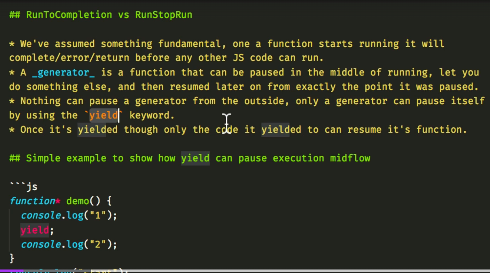

# Generator Function

- Syntax

```js
function* abc() {
  yield 1;
  yield 2;
  yield 3;
}

const test = abc();
console.log(test.next().value); // 1
console.log(test.next().value); // 2
console.log(test.next().value); // 3
```



TODO: Need to deep dive more into the concept;
